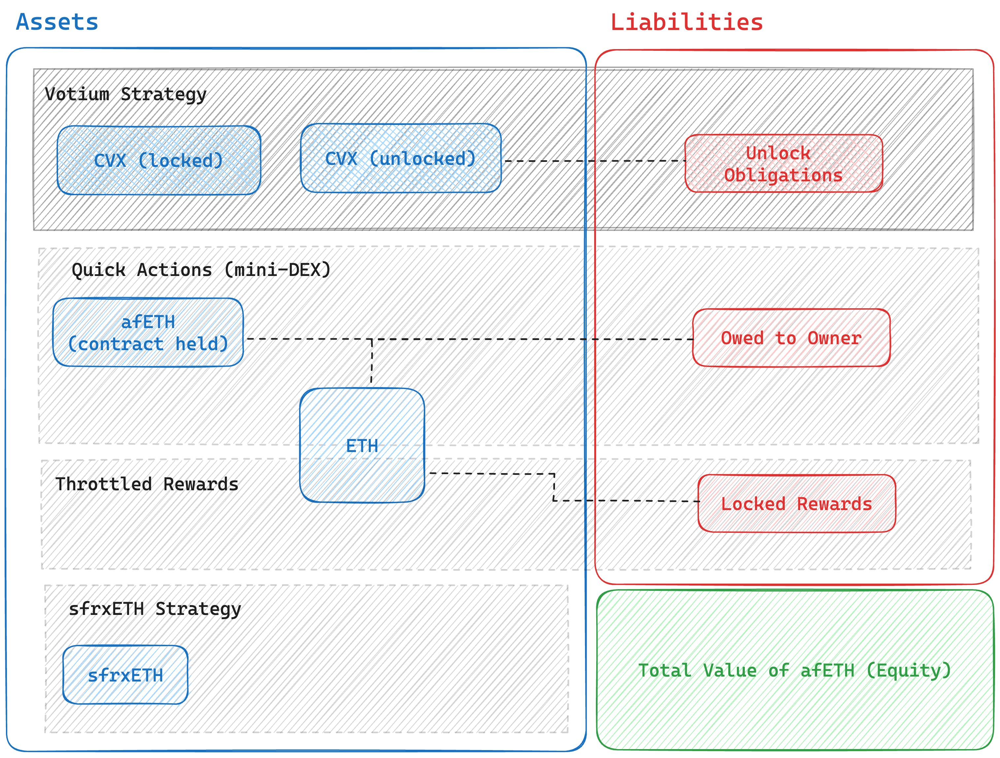
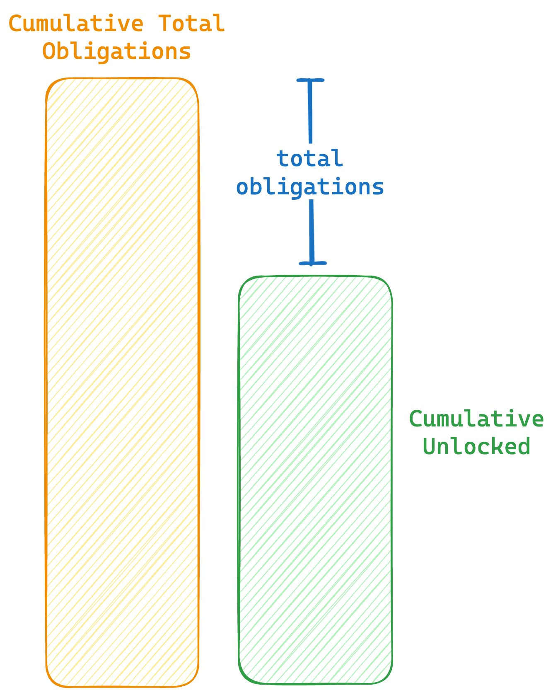

# AfEth

The [`AfEth.sol`](../src/AfEth.sol) contract is the center point to the afETH asset/strategy for
users. Users deposit and withdraw ETH from afETH and the vault in turn administers the two
sub-strategies:
- [The "Votium" Strategy](../src/strategies/VotiumStrategy.sol)
- [The sfrxETH Strategy](../src/strategies/SfrxEthStrategy.sol)

The underlying assets for afETH are Convex's CVX token and Frax's fee accruing LST token sfrxETH.
The two strategies have a target ratio, intitially configured to be 70% sfrxETH and 30% CVX, the
vault may deviate from this ratio as the rebalancing process is manual and must be triggered by the
owner / rewarder addresses.

The afETH contract administers a mini-DEX that allows users to move in and out of afETH
trading against a limited pool of assets configured owned by the manager. This is to provide smaller
users with a gas efficient method of entering the contract as well as allowing users to withdraw
early (unlocking locked CVX is associated with a withdraw delay).

## Strategy & Accounting Overview

The above diagram provides an overview of the different value measures tracked by the contract
categorized as:

- Assets: Tokens such as sfrxETH, CVX or ETH that the contract holds or things that it's owed from
  other contracts such as locked CVX
- Liabilities: Things that do not directly belong to current afETH holders and must are owed to some
  other party (either pending CVX redemptions or owner quick action and fee assets)
- Equity: The net value that belongs to afETH holders (assets - liabilities)

This will be quite familiar to anyone who's already familiar with general accounting principles.
Following that as a general invariant updates to value within afETH must be symmetric on both sides
e.g.
- a deposit increases assets (+sfrxETH, +CVX) and equity (total vault value owed to holders)
- a quick withdraw exhanges owner owed ETH (-ETH) for owned owed afETH (+afETH)
- new rewards are deposited (+ETH) and initially locked (+locked rewards liability)

The only exception to the general balance rule are profit / loss events e.g.
- appreciation / depreciation of ETH & CVX
- gradual unlocking of rewards

## The sfrxETH Strategy

The sfrxETH strategy is a relatively simple strategy, trading ETH for sfrxETH and back for deposits
/ withdraws. Being so simple and managing a directly transferable and liquid asset the strategy has
been implemented as an internal library to avoid any unnecessary call overhead. Modularity was not
required at this as the main contracts are upradeable.

When depositing the strategy first checks if it's able to receive an ETH:frxETH rate that's better
than 1:1 by going through the frxETH:ETH curve pool, otherwise it'll fallback to the FrxETH Minter
contract.

**Security Note:** To price the sfrxETH in terms of ETH the strategy relies upon the frxETH/ETH
price oracle provided by the aforementioned Curve and multiplied by the frxETH/sfrxETH price
provided by the sfrxETH contract itself.

## The Votium Strategy

The votium strategy contract is an external upgradeable contract administered by the afETH contract
to lock and unlock CVX tokens. CVX tokens are locked using the `CvxLockerV2` contract which locks
CVX for 16 week periods during which the CVX **cannot** be withdrawn. Accrued rewards are to be
claimed and processed by a `rewarder` address via the `claimRewards` and `swapRewards` methods.

When a deposit is made the incoming ETH is swapped for CVX and locked. When a withdrawal is requested the
contract first checks whether sufficient CVX is unlocked to cover other pending withdrawals plus the
new request, if so the CVX is immediately swapped for ETH and given to the user. Otherwise a pending
withdrawal is created.

Before locking new CVX the contract checks that it's not locking any CVX that is needed to cover
pending withdrawals.

To efficiently track the priority of different withdrawals and provide unique IDs for different
withdrawals the strategy tracks cumulative unlocked and unlock obligation amounts. The current total
obligations is the difference between the two values. Unlike the total obligations the cumulative
total obligations never goes down, meaning it can act as a useful pending withdrawal ID *and*
indicate the ordering of when a withdrawal can be processed, independently of whether higher
priority withdrawals have been processed.

The votium strategy uses the CVX-ETH pool to swap in and out and uses a chainlink oracle feed to
price and value held CVX. Locked CVX is valued at face value with no discount for the lock-up period.

## Reward Locking

Similar to Yearn's vaults new ETH rewards are locked up and only gradually accrue to the total value
of the vault over time. This is to prevent large discrete jumps in the ETH/afETH price such that
a searcher or other MEV extractor could sandwich reward distributions to capture most of their
value.
